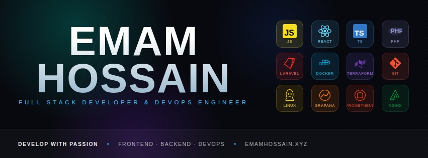

# Hello World!, I'm Emam Hossain 👋🏼

### 🚀 Full-Stack Web Developer | DevOps Engineer

* 👋 Hi, I’m **@EmamHosain**
* 💻 I build **scalable full-stack web applications** and design **modern DevOps workflows**
* 🌱 Currently exploring advanced **DevOps, cloud infrastructure, and automation**
* 🤝 Open to collaborate on **Full-Stack & DevOps projects**

---

## 🔥 Tech Stack

### 💻 Full-Stack Development

* 🌐 Frontend: HTML, CSS, Bootstrap, Tailwind CSS, JavaScript, jQuery, Alpine js, React.js, TypeScript
* ⚙️ Backend: PHP, Laravel
* 🔗 SPA & Tools: Inertia.js
* 🗄️ Database: MySQL
* 🔧 Version Control: Git & GitHub

### ⚙️ DevOps & Tools

- 🐳 Docker & Docker Compose (Containerization)
- 🚀 Jenkins (CI/CD Automation)
- ⚙️ GitHub Actions (CI/CD Pipelines)
- 🏗️ Terraform (Infrastructure as Code)
- 🤖 Ansible (Configuration Management & Automation)
- ☁️ AWS EC2 & VPS Deployment
- 🐧 Linux Server Administration (Ubuntu)
- 🌐 Nginx Web Server Configuration
- 🔒 SSL/TLS (Let's Encrypt) & HTTPS Setup
- 📊 Grafana (Monitoring & Visualization)
- 📈 Prometheus (Metrics Collection & Alerting)
- 📝 Loki (Log Aggregation)
- 🔧 SSH, Git & GitHub
- 🌍 Domain, DNS & Virtual Host Configuration
- 📦 Environment Configuration (.env Management)
- 🚀 Application Deployment & Production Optimization
- 🔐 Server Security Best Practices

  
## You can **reach me** via:  

      

<picture>
  <source media="(prefers-color-scheme: dark)" srcset="https://raw.githubusercontent.com/tobiasmeyhoefer/tobiasmeyhoefer/output/github-snake-dark.svg" />
  <source media="(prefers-color-scheme: light)" srcset="https://raw.githubusercontent.com/tobiasmeyhoefer/tobiasmeyhoefer/output/github-snake.svg" />
  
</picture>
